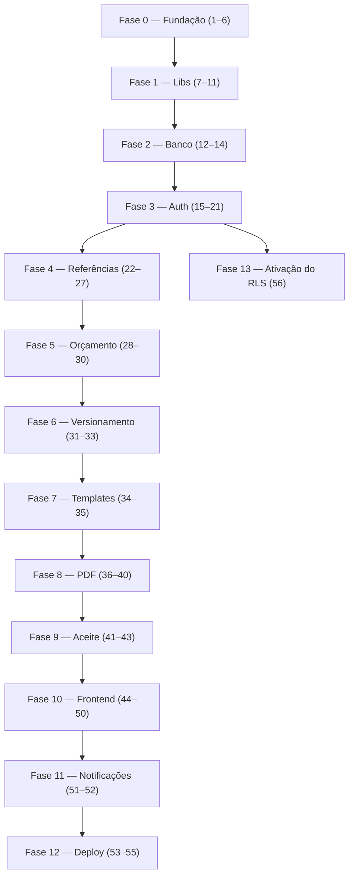

# Implementation Plan

## Overview

Este documento descreve o plano de implementação do MVP do ni-doc, organizado em fases sequenciais (Fase 0 a Fase 12). Cada tarefa segue o ciclo TDD (escrever teste → ver falhar → implementar → ver passar → refatorar), referencia o requisito que implementa e só é concluída quando todos os testes passam e o lint não acusa erros. As fases são sequenciais: cada uma depende da conclusão da anterior.

## Tasks

### Fase 0 — Fundação do Projeto

- [x] 1. Estrutura inicial do monorepo
  - Criar pasta raiz `ni-doc/` e configurar workspaces no `package.json` raiz
  - Criar `backend/package.json` e `frontend/package.json`
  - Criar `.gitignore` (`node_modules/`, `.env`, `dist/`, `pdfs/`), `.editorconfig`, `.nvmrc` (`22`), `README.md`
  - Criar `.env.example` com: `DATABASE_URL`, `CRYPTO_KEY`, `SESSION_SECRET`, `PORT`, `NODE_ENV`, `SMTP_HOST`, `SMTP_PORT`, `SMTP_USER`, `SMTP_PASS`, `SMTP_FROM`, `PDFS_DIR`
  - DoD: `npm install` na raiz funciona sem erros; `.env.example` documenta todas as variáveis
  - _Requirements: setup_

- [x] 2. Configurar TypeScript estrito
  - Criar `backend/tsconfig.json` e `frontend/tsconfig.json`
  - Ativar `strict`, `noUncheckedIndexedAccess`, `noImplicitOverride`
  - Configurar `outDir`/`rootDir` no backend e paths (`@/` → `src/`)
  - Teste: `npm run build` compila sem erros em ambos os pacotes
  - _Requirements: RNF-005_

- [x] 3. Configurar ESLint + Prettier
  - Criar `backend/.eslintrc.cjs`, `frontend/.eslintrc.cjs`, `.prettierrc`
  - Instalar ESLint, Prettier e `@typescript-eslint`; configurar regras recomendadas
  - Adicionar scripts `lint` e `format` no `package.json`
  - Teste: `npm run lint` retorna sucesso em código limpo
  - _Requirements: RNF-005_

- [x] 4. Configurar Vitest no backend
  - Criar `backend/vitest.config.ts` e `backend/src/__tests__/setup.ts`; script `test`
  - Instalar `vitest`, `@vitest/coverage-v8`, `supertest`, `@types/supertest`
  - Configurar cobertura mínima de 80% e criar teste dummy
  - Teste: `npm test` executa o teste dummy com sucesso
  - _Requirements: RNF-005_

- [x] 5. Configurar Docker Compose para desenvolvimento
  - Criar `docker-compose.yml`, `backend/Dockerfile`, `frontend/Dockerfile`
  - Serviço `postgres` (16-alpine, volume persistente), `backend` (Node 22), `frontend` (Vite)
  - Definir rede comum e variáveis via `.env`
  - Teste: `docker compose up` sobe os três serviços sem erros
  - _Requirements: RNF-006_

- [x] 6. CI básico no GitHub Actions
  - Criar `.github/workflows/ci.yml`
  - Trigger em `push`/`pull_request` para `main` e `develop`; serviço PostgreSQL de teste
  - Passos: checkout → setup-node → install → lint → build → test (`checkout@v5`, `setup-node@v6`)
  - Teste: push na branch de teste dispara o workflow e ele passa
  - _Requirements: RNF-005_

### Fase 1 — Bibliotecas Base (Lib)

- [x] 7. Implementar criptografia AES-256-GCM
  - Criar `backend/src/lib/crypto.ts` e testes em `backend/src/lib/__tests__/crypto.test.ts`
  - Testes: `criptografar()` varia por IV; round-trip; falha se authTag adulterado; `hashDocumento()` estável e normaliza pontuação
  - Implementar `criptografar`, `descriptografar`, `hashDocumento`; validar `CRYPTO_KEY` (32 bytes)
  - DoD: cobertura 100%
  - _Requirements: RF-004_

- [x] 8. Implementar hash de senha com Argon2id
  - Criar `backend/src/lib/senha.ts` e testes
  - Testes: hash varia; `verificarSenha` true/false; parâmetros OWASP (64MB, 3, 4)
  - DoD: cobertura 100%
  - _Requirements: RF-004_

- [x] 9. Implementar geração de token público
  - Criar `backend/src/lib/token.ts` e testes
  - Testes: formato `uuid.hmac`; tokens distintos; validação detecta HMAC/UUID alterados
  - DoD: cobertura 100%
  - _Requirements: RF-018_

- [x] 10. Implementar validação de CPF/CNPJ
  - Criar `backend/src/lib/documento.ts` e testes
  - Testes: `validarCPF`/`validarCNPJ` para casos válidos e inválidos (dígito verificador)
  - DoD: cobertura 100%
  - _Requirements: RF-010_

- [x] 11. Implementar cálculo de totais de orçamento
  - Criar `backend/src/lib/orcamento-calculo.ts` (funções puras) e testes
  - Testes: `calcularTotalItem` (percentual/fixo/sem desconto/não-negativo); `calcularSubtotal`; `calcularTotal` (desconto global, não-negativo)
  - DoD: cobertura 100%, sem dependências externas
  - _Requirements: RF-007_

### Fase 2 — Banco de Dados

- [x] 12. Migration inicial de schema
  - Criar `backend/src/db/migrations/001_initial_schema.sql` e `backend/src/db/migrate.ts`; script `migrate`
  - Criar todas as tabelas na ordem de FKs, índices e extensões (`uuid-ossp`, `pgcrypto`)
  - Runner de migrations idempotente que lê arquivos `.sql` em ordem
  - Teste: `npm run migrate` cria todas as tabelas no banco de teste
  - _Requirements: infra_

- [x] 13. Migration de RLS
  - Criar `backend/src/db/migrations/002_rls_policies.sql`
  - Habilitar RLS e criar policy de isolamento em: `usuarios`, `clientes`, `empresas`, `responsaveis_tecnicos`, `orcamentos`, `templates`, `eventos_auditoria`
  - Policy de `orcamento_itens` via `EXISTS` com `orcamentos`
  - Teste: dois tenants, queries sem `WHERE tenant_id` retornam só o tenant atual
  - _Requirements: RF-002_

- [x] 14. Seed de desenvolvimento
  - Criar `backend/src/db/migrations/003_seed_dev.sql`; script `seed`
  - 2 tenants; admin + operador, 3 clientes, 2 responsáveis, 1 template, 1 rascunho por tenant
  - Teste: `npm run seed` popula o banco e login funciona
  - _Requirements: dev_

### Fase 3 — Autenticação e Multi-tenancy

- [x] 15. Configuração do Express
  - Criar `backend/src/app.ts`, `server.ts`, `config/env.ts`, `config/database.ts`
  - Validar env com Zod; instância Kysely com pool; middlewares (`helmet`, `cors`, `cookie-parser`, `pino-http`, `express.json`); error-handler central; rota `/health`
  - Testes: `/health` 200; env ausente falha na inicialização; error handler retorna JSON
  - _Requirements: infra_

- [x] 16. Implementar repositório de usuários
  - Criar `backend/src/repositories/usuario.repository.ts` e testes
  - Testes: `criar` com e-mail criptografado+hash; `buscarPorEmail` por hash; `buscarPorId` descriptografa; retorno `null` quando ausente
  - DoD: e-mail criptografado no banco; cobertura 80%+
  - _Requirements: RF-001_

- [x] 17. Implementar serviço de autenticação
  - Criar `backend/src/services/auth.service.ts`, testes e `repositories/sessao.repository.ts`
  - Testes: `login` ok/invalid/inativo/auditoria; `logout` invalida; `validarSessao` válida/expirada
  - DoD: sessões no PostgreSQL; auditoria registrada
  - _Requirements: RF-001_

- [x] 18. Rotas de autenticação
  - Criar `backend/src/routes/auth.routes.ts`, `schemas/auth.schema.ts` e testes
  - Testes: login 200+cookie / 401 / 400; logout limpa cookie; `/me` 200 e 401
  - DoD: cookie `HttpOnly`, `Secure`, `SameSite=Lax`
  - _Requirements: RF-001_

- [x] 19. Middlewares de auth e tenant
  - Criar `backend/src/middlewares/auth.ts`, `tenant.ts` e testes
  - Testes: `autenticar` 401 sem cookie/expirada; `next()` e anexa `req.usuario`/`req.sessao`; `setTenant` executa `set_config`
  - DoD: RLS funciona com tenant setado
  - _Requirements: RF-001, RF-002_

- [x] 20. Rate limiting no login
  - Criar `backend/src/middlewares/rate-limit.ts`; aplicar em `auth.routes.ts`
  - `express-rate-limit` em memória, 5 tentativas / 15 min por IP, 429 claro
  - Teste: sexta tentativa retorna 429
  - _Requirements: RNF-002_

- [x] 21. Serviço de auditoria
  - Criar `backend/src/services/auditoria.service.ts`, `repositories/auditoria.repository.ts` e testes
  - Testes: `registrar` com todos os campos e JSONB; `listar` por entidade e por tenant
  - DoD: chamado nos serviços de auth e orçamento
  - _Requirements: RF-003_

### Fase 4 — Entidades de Referência

- [x] 22. Repositório e serviço de clientes
  - Criar `backend/src/repositories/cliente.repository.ts`, `services/cliente.service.ts` e testes
  - Testes: valida CPF/CNPJ; rejeita duplicado no tenant; criptografa+hash; `buscarPorId` descriptografa; busca ILIKE; `atualizar` não afeta versões emitidas; `desativar` soft delete
  - _Requirements: RF-010_

- [x] 23. Rotas de clientes
  - Criar `backend/src/routes/clientes.routes.ts`, `schemas/cliente.schema.ts` e testes
  - Testes: GET `?q=`, POST, PUT, GET `:id`; todas exigem autenticação
  - DoD: validação com Zod
  - _Requirements: RF-010_

- [x] 24. Repositório e serviço de empresas
  - Análogo aos clientes, para `empresas` (`repository`, `service`, testes)
  - DoD: autocomplete filtra por tipo (`cliente_pj`)
  - _Requirements: RF-011_

- [x] 25. Rotas de empresas
  - Análogo às rotas de clientes, para empresas
  - _Requirements: RF-011_

- [x] 26. Repositório e serviço de responsáveis técnicos
  - Análogo aos clientes, para `responsaveis_tecnicos`
  - _Requirements: RF-012_

- [x] 27. Rotas de responsáveis técnicos
  - Análogo às rotas de clientes, para responsáveis técnicos
  - _Requirements: RF-012_

### Fase 5 — Orçamento (Core)

- [x] 28. Repositório de orçamentos
  - Criar `backend/src/repositories/orcamento.repository.ts` e testes
  - Testes: `criar` em transação; número sequencial por tenant (`ORC-{ANO}-{SEQ}`); `buscarPorId` com itens; `atualizar` substitui itens; `listarPorTenant` paginado e por status; `deletar` só rascunho
  - DoD: transações atômicas; numeração sem race condition
  - _Requirements: RF-005, RF-006_

- [x] 29. Serviço de orçamento
  - Criar `backend/src/services/orcamento.service.ts` e testes
  - Testes: `criar` exige cliente/título/item e calcula totais; `atualizar` só rascunho, recalcula e audita; `deletar` só rascunho; `listar` respeita tenant
  - DoD: auditoria em criar/atualizar/deletar
  - _Requirements: RF-005, RF-006, RF-007_

- [x] 30. Rotas de orçamentos
  - Criar `backend/src/routes/orcamentos.routes.ts`, `schemas/orcamento.schema.ts` e testes
  - Testes: POST, GET lista, GET `:id`, PUT rascunho, DELETE rascunho, PUT em enviado → 409
  - DoD: endpoints RESTful, validação Zod
  - _Requirements: RF-005, RF-006, RF-007_

### Fase 6 — Versionamento e Snapshot

- [x] 31. Serviço de snapshot
  - Criar `backend/src/services/snapshot.service.ts` e testes
  - Testes: copia cliente/empresa/itens/responsável e totais (não referência); snapshot estável após alterar cliente
  - DoD: JSONB puro; teste de imutabilidade passa
  - _Requirements: RF-008_

- [x] 32. Serviço de versionamento
  - Criar `backend/src/services/versionamento.service.ts` e testes
  - Testes: `enviar` só rascunho com itens; cria v1 e v(N+1); gera token; status `enviado`; invalida aceite anterior; auditoria
  - DoD: versionamento sequencial, token único por versão
  - _Requirements: RF-008, RF-009_

- [x] 33. Rota de envio
  - Adicionar `POST /:id/enviar` em `orcamentos.routes.ts` e testes (PDF integrado depois na tarefa 42)
  - Testes: retorna versão criada; rascunho vazio → 400; já aprovado → 409
  - DoD: endpoint funciona (`pdf_path` nulo até a integração de PDF)
  - _Requirements: RF-008_

### Fase 7 — Templates

- [x] 34. Serviço de templates
  - Criar `backend/src/repositories/template.repository.ts`, `services/template.service.ts` e testes
  - Testes: `criarTemplatePadrao` v1 ao criar tenant; `salvar` cria nova versão; `buscarAtivo`; `buscarPorId` versão específica; auditoria ao salvar
  - DoD: versão antiga permanece acessível
  - _Requirements: RF-013, RF-014_

- [x] 35. Rotas de template
  - Criar `backend/src/routes/templates.routes.ts`, `schemas/template.schema.ts` e testes
  - Testes: GET `/atual`; PUT `/atual` cria versão (admin); operador → 403
  - DoD: restrição de papel aplicada
  - _Requirements: RF-013, RF-014_

### Fase 8 — Geração de PDF

- [x] 36. Renderizador de HTML
  - Criar `backend/src/services/html-renderer.service.ts` e testes
  - Testes: substitui `{cliente}`/`{numero}`; itera itens; aplica CSS; embute imagens base64
  - DoD: HTML válido, placeholders substituídos
  - _Requirements: RF-016_

- [~] 37. Quebra de página automática
  - Criar `backend/src/services/paginacao.service.ts` e testes
  - Testes: 5 itens/área p/3 → 2 páginas; cabem → 1 página; header/footer repetidos; nenhum item cortado; ordem preservada
  - DoD: cobre bordas (1, 0, item maior que a área)
  - _Requirements: RF-015_

- [~] 38. Gerador de PDF com Puppeteer
  - Criar `backend/src/lib/pdf.ts`, `services/pdf.service.ts` e testes
  - Testes: `gerarPdf` Buffer válido, A4, hash SHA-256, salva em disco; `buscarPdf` retorna armazenado; erro se ausente (não regenera)
  - DoD: PDF em < 2s, hash calculado, arquivo imutável
  - _Requirements: RF-016, RF-017_

- [~] 39. QR Code no PDF
  - Criar `backend/src/lib/qrcode.ts` e testes
  - Testes: `gerarQrCodeDataUrl` retorna data URL; URL contém token; tamanho mínimo escaneável
  - DoD: QR embutido no HTML, URL `/publico/orcamento/:token`
  - _Requirements: RF-018_

- [~] 40. Integração envio → PDF
  - Ajustar `versionamento.service.ts`
  - No envio, após snapshot, chamar `pdfService.gerar()`; armazenar `pdf_path` e `pdf_hash`; rollback se falhar
  - Teste: envio gera PDF e o PDF é imutável
  - _Requirements: RF-016_

### Fase 9 — Aceite e Aprovação

- [~] 41. Serviço de aceite
  - Criar `backend/src/services/aceite.service.ts` e testes
  - Testes: `aprovarViaCliente` valida token, registra IP/UA/hash/método, muda status, rejeita expirado/duplicado; `aceiteManual` exige justificativa e registra operador; gera comprovante PDF
  - DoD: evidências registradas, comprovante gerado, auditoria
  - _Requirements: RF-019, RF-020, RF-021_

- [~] 42. Rotas públicas
  - Criar `backend/src/routes/publico.routes.ts` e testes
  - Testes: GET snapshot; 404 token inválido; 410 expirado; POST aprovar registra aceite; 409 já aprovado; reprovar registra
  - DoD: rotas sem auth, com rate limiting
  - _Requirements: RF-019_

- [~] 43. Rota de aceite manual
  - Adicionar `POST /:id/aceite-manual` em `orcamentos.routes.ts` e testes
  - Testes: exige justificativa; registra operador; muda status para `aprovado`
  - _Requirements: RF-020_

### Fase 10 — Frontend

- [~] 44. Setup do React + Vite
  - Criar `frontend/vite.config.ts`, `index.html`, `src/main.tsx`, `src/App.tsx`
  - Configurar React Router, TanStack Query, Zustand, proxy para backend, estrutura de pastas
  - DoD: `npm run dev` sobe a SPA e chamadas ao backend funcionam
  - _Requirements: setup_

- [~] 45. Tela de login
  - Criar `frontend/src/pages/Login.tsx`, `hooks/useAuth.ts`, `stores/auth.store.ts`
  - Form com React Hook Form + Zod; `POST /api/auth/login`; estado no Zustand; redirect; tratar erro
  - DoD: login funciona, erros exibidos, rota privada redireciona
  - _Requirements: RF-001_

- [~] 46. Lista de orçamentos
  - Criar `frontend/src/pages/OrcamentoLista.tsx`, `hooks/useOrcamentos.ts`
  - Listar com TanStack Query; filtros por status; botão novo; ações editar/visualizar/excluir
  - DoD: lista carrega e navegação para o editor funciona
  - _Requirements: RF-005_

- [~] 47. Editor de orçamento
  - Criar `frontend/src/pages/OrcamentoEditor.tsx`, `components/ItemOrcamentoRow.tsx`, `components/Autocomplete.tsx`
  - Form com cliente (autocomplete), título, descrição; itens editáveis; cálculo em tempo real; autocomplete de responsável; salvar rascunho
  - DoD: criar/editar/salvar funcionam, cálculos em tempo real, validação
  - _Requirements: RF-005, RF-006, RF-007_

- [~] 48. Envio e versionamento (frontend)
  - Adicionar botão "Enviar" em `OrcamentoEditor.tsx`
  - Modal de confirmação; `POST /api/orcamentos/:id/enviar`; exibir link público; listar versões
  - DoD: envio funciona, versões listadas
  - _Requirements: RF-008_

- [~] 49. Editor de template
  - Criar `frontend/src/pages/TemplateEditor.tsx`, `components/CanvasA4.tsx`
  - Canvas A4 com drag & drop; upload de PDF de fundo, imagens e fontes; placeholders; área de itens; salvar
  - DoD: editor funcional, template salvo como JSON, nova versão criada
  - _Requirements: RF-014_

- [~] 50. Página pública de aprovação
  - Criar `frontend/src/pages/PublicoOrcamento.tsx`
  - Ler token da URL; `GET /api/publico/orcamento/:token`; PDF embutido; checkbox + Aprovar/Reprovar; confirmação
  - DoD: cliente acessa/aprova/vê comprovante; token inválido mostra erro
  - _Requirements: RF-019_

### Fase 11 — Notificações (MVP Simplificado)

- [~] 51. Lib de e-mail
  - Criar `backend/src/lib/email.ts` e testes
  - Testes: usa SMTP configurado; serializa destinatário; falhas são logadas sem quebrar o fluxo
  - DoD: envio funciona com SMTP real (ou mock)
  - _Requirements: RF-022_

- [~] 52. Templates de e-mail
  - Criar `backend/src/lib/email-templates.ts`
  - Templates "orçamento enviado" (com link), "aprovado" (notifica operador), "reprovado"
  - DoD: e-mails enviados nos eventos corretos, log na auditoria
  - _Requirements: RF-022_

### Fase 12 — Deploy e Produção

- [~] 53. Configurar Nginx na VPS
  - Criar `nginx/ni-doc.conf`
  - Proxy reverso para backend; servir estáticos; TLS com Let's Encrypt; headers de segurança (HSTS, CSP)
  - DoD: HTTPS funciona, backend acessível via domínio
  - _Requirements: RNF-006_

- [~] 54. Pipeline de deploy
  - Criar `.github/workflows/deploy.yml`
  - Rodar CI; SSH na VPS; `git pull && docker compose -f docker-compose.prod.yml up -d --build`; migrations; health check; rollback automático se falhar
  - DoD: push na `main` faz deploy automático com health check
  - _Requirements: deploy_

- [~] 55. Job de limpeza de PDFs
  - Criar `backend/src/jobs/limpar-pdfs.ts`
  - Cron diário; remover PDFs com mais de 1 ano (após retenção legal); registrar remoção na auditoria
  - DoD: job roda, PDFs antigos removidos, auditoria registrada
  - _Requirements: cleanup_

### Fase 13 — Ativação do RLS por Request (Correção de Segurança)

> **Motivação:** investigação (`.agents/tasks/settenant-rls-investigation.md`) constatou que o
> middleware `setTenant` existe mas nunca é registrado no pipeline Express, então
> `app.current_tenant` nunca é setado em runtime e as policies de RLS da migration
> `002_rls_policies.sql` ficam inertes. Hoje o isolamento entre tenants depende
> exclusivamente do filtro aplicacional `WHERE tenant_id` nos repositórios, o que
> contraria o RF-002 (critérios 2 e 3), o ADR-006 e a Correctness Property nº 1 do
> design. Esta fase ativa o RLS como camada de defesa efetiva no banco. É uma correção
> transversal, independente das fases de feature, e pode ser executada assim que a
> infraestrutura de dados (Fase 2) e de auth/tenant (Fase 3) estiver pronta.

- [ ] 56. Ativar RLS por request (conexão por request + `setTenant` + papel sem BYPASSRLS)
  - **Papel de banco:** criar/documentar um papel de aplicação sem `BYPASSRLS` e que não
    seja superusuário/owner das tabelas, usado pelo backend em runtime; reservar o papel
    privilegiado apenas para `migrate`/`seed`. Ajustar `.env.example` (`DATABASE_URL`) e
    docker-compose conforme necessário.
  - **Conexão por request:** introduzir um escopo transacional/conexão fixa por request
    (ex.: `AsyncLocalStorage` guardando a `Transaction`/conexão, ou repasse de `trx` pelo
    contexto do service) para que `set_config('app.current_tenant', <uuid>, true)` persista
    por todas as queries do request. Ajustar `config/database.ts` e a injeção de dependências
    em `app.ts` para que os repositórios usem a conexão do request, não o pool global.
  - **Registrar `setTenant`:** aplicar o middleware `tenant.ts` logo após `autenticar` em
    todos os routers de domínio (`clientes`, `empresas`, `responsaveis`, `orcamentos`,
    `templates`), setando o GUC dentro do escopo transacional do request.
  - **Repositórios:** manter os `WHERE tenant_id = ...` existentes como defesa em profundidade;
    garantir que as queries em tabelas-filhas (`orcamento_itens`, `orcamento_versoes`,
    `orcamento_aceites`) fiquem cobertas pelas policies via `EXISTS`.
  - **Testes de integração (TDD):** criar testes com PostgreSQL real (serviço do docker-compose
    ou Testcontainers) conectando com o papel não-privilegiado, provando: (a) com o GUC setado,
    só o tenant corrente enxerga suas linhas; (b) sem o GUC, nenhuma linha retorna; (c) tentativa
    de acesso cross-tenant falha no banco mesmo se o filtro aplicacional for omitido; (d) acesso
    a recurso de outro tenant resulta em 404 na API (RF-002, critério 4).
  - DoD: `setTenant` registrado e efetivo; RLS barra acesso cross-tenant no banco de forma
    comprovada por teste de integração; backend roda com papel que respeita RLS; filtro
    aplicacional mantido como redundância; lint/build/testes passam.
  - _Requirements: RF-002_

## Notes

- Ciclo TDD obrigatório: testes antes da implementação; tarefa concluída só com testes passando e lint sem erros.
- Cobertura: `lib/` exige 100%; serviços e repositórios 80%+.
- Multi-tenancy: a partir da Fase 3, todo acesso a dados respeita isolamento por `tenant_id`. O isolamento no banco via RLS (`SET LOCAL app.current_tenant`) só passa a ser efetivamente ativo após a Fase 13 (tarefa 56); até lá o isolamento é garantido apenas pelo filtro aplicacional `WHERE tenant_id` nos repositórios.
- Imutabilidade: snapshots e PDFs emitidos são imutáveis; alterações posteriores em entidades de referência não afetam versões já emitidas.
- Dependências cruzadas: a tarefa 33 (rota de envio) retorna versão sem PDF; `pdf_path` só é preenchido pela tarefa 40 (integração envio → PDF), que depende das tarefas 36–39. A tarefa 41 (aceite) reutiliza a geração de PDF da Fase 8. As telas de frontend dependem das rotas de backend correspondentes.

## Task Dependency Graph

As fases são sequenciais: cada fase depende da conclusão da anterior. Tarefas dentro da mesma onda podem ser executadas em paralelo.



A Fase 13 (ativação do RLS) é uma correção de segurança transversal: depende apenas da infraestrutura de banco (Fase 2) e de auth/tenant (Fase 3), não das fases de feature. Pode ser priorizada e executada de forma independente.

```json
{
  "waves": [
    { "wave": 0, "name": "Fundação do Projeto", "tasks": ["1", "2", "3", "4", "5", "6"], "dependsOn": [] },
    { "wave": 1, "name": "Bibliotecas Base", "tasks": ["7", "8", "9", "10", "11"], "dependsOn": [0] },
    { "wave": 2, "name": "Banco de Dados", "tasks": ["12", "13", "14"], "dependsOn": [1] },
    { "wave": 3, "name": "Autenticação e Multi-tenancy", "tasks": ["15", "16", "17", "18", "19", "20", "21"], "dependsOn": [2] },
    { "wave": 4, "name": "Entidades de Referência", "tasks": ["22", "23", "24", "25", "26", "27"], "dependsOn": [3] },
    { "wave": 5, "name": "Orçamento Core", "tasks": ["28", "29", "30"], "dependsOn": [4] },
    { "wave": 6, "name": "Versionamento e Snapshot", "tasks": ["31", "32", "33"], "dependsOn": [5] },
    { "wave": 7, "name": "Templates", "tasks": ["34", "35"], "dependsOn": [6] },
    { "wave": 8, "name": "Geração de PDF", "tasks": ["36", "37", "38", "39", "40"], "dependsOn": [7] },
    { "wave": 9, "name": "Aceite e Aprovação", "tasks": ["41", "42", "43"], "dependsOn": [8] },
    { "wave": 10, "name": "Frontend", "tasks": ["44", "45", "46", "47", "48", "49", "50"], "dependsOn": [9] },
    { "wave": 11, "name": "Notificações", "tasks": ["51", "52"], "dependsOn": [10] },
    { "wave": 12, "name": "Deploy e Produção", "tasks": ["53", "54", "55"], "dependsOn": [11] },
    { "wave": 13, "name": "Ativação do RLS por Request", "tasks": ["56"], "dependsOn": [3] }
  ]
}
```
