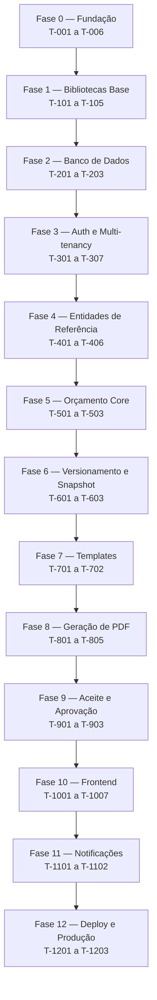

# Implementation Plan

## Overview

Este documento descreve o plano de implementação do MVP do ni-doc, organizado em fases sequenciais (Fase 0 a Fase 12) e marcos de verificação. Cada fase agrupa tarefas (`T-XXX`) que entregam uma capacidade coesa do sistema, da fundação do projeto ao deploy em produção.

**Como executar:**

- Cada tarefa segue o ciclo **TDD**: escrever teste → ver falhar → implementar → ver passar → refatorar.
- Uma tarefa só é considerada concluída quando **todos os testes passam** e o **lint não acusa erros**.
- Cada tarefa referencia o requisito que implementa (ex: `RF-001`).
- Ordem sequencial: tarefas com dependências aparecem depois de suas bases.
- Estimativas em horas (h) são aproximadas e pressupõem foco.

## Tasks

## Fase 0 — Fundação do Projeto

### T-001 — Estrutura inicial do monorepo (2h)

**Requisito:** — (setup)

**Objetivo:** Criar a estrutura de pastas do projeto com backend e frontend separados.

**Arquivos:**
- `package.json` (raiz, com workspaces)
- `backend/package.json`
- `frontend/package.json`
- `.gitignore`
- `.editorconfig`
- `.nvmrc` (conteúdo: `22`)
- `.env.example`
- `README.md`

**Tarefas:**
1. Criar pasta raiz `ni-doc/`
2. Configurar workspaces no `package.json` raiz
3. Criar `.gitignore` com `node_modules/`, `.env`, `dist/`, `pdfs/`
4. Criar `.nvmrc` com `22`
5. Criar `.env.example` com as variáveis:
   - `DATABASE_URL`
   - `CRYPTO_KEY`
   - `SESSION_SECRET`
   - `PORT`
   - `NODE_ENV`
   - `SMTP_HOST`, `SMTP_PORT`, `SMTP_USER`, `SMTP_PASS`, `SMTP_FROM`
   - `PDFS_DIR`

**Teste:** — (setup, sem testes)

**Definition of Done:**
- Estrutura de pastas criada
- `npm install` na raiz funciona sem erros
- `.env.example` documenta todas as variáveis

---

### T-002 — Configurar TypeScript estrito (1h)

**Requisito:** RNF-005

**Objetivo:** Configurar TypeScript com tipagem estrita em backend e frontend.

**Arquivos:**
- `backend/tsconfig.json`
- `frontend/tsconfig.json`

**Tarefas:**
1. Ativar `"strict": true`
2. Ativar `"noUncheckedIndexedAccess": true`
3. Ativar `"noImplicitOverride": true`
4. Configurar `outDir` e `rootDir` no backend
5. Configurar paths (`@/` → `src/`)

**Teste:** `npm run build` em ambos os pacotes deve compilar sem erros.

**Definition of Done:**
- TypeScript compila sem warnings
- Paths funcionam corretamente

---

### T-003 — Configurar ESLint + Prettier (1h)

**Requisito:** RNF-005

**Objetivo:** Padronizar estilo de código.

**Arquivos:**
- `backend/.eslintrc.cjs`
- `frontend/.eslintrc.cjs`
- `.prettierrc`
- Scripts `lint` e `format` no `package.json`

**Tarefas:**
1. Instalar ESLint, Prettier e plugins (`@typescript-eslint`)
2. Configurar regras recomendadas
3. Adicionar scripts `lint` e `format`

**Teste:** `npm run lint` retorna sucesso em código limpo.

**Definition of Done:**
- Lint funciona em ambos os pacotes
- Formatação automática configurada

---

### T-004 — Configurar Vitest no backend (1h)

**Requisito:** RNF-005

**Objetivo:** Configurar a suíte de testes.

**Arquivos:**
- `backend/vitest.config.ts`
- `backend/src/__tests__/setup.ts`
- Script `test` no `package.json`

**Tarefas:**
1. Instalar `vitest`, `@vitest/coverage-v8`, `supertest`, `@types/supertest`
2. Configurar cobertura mínima de 80%
3. Criar teste dummy para validar setup

**Teste:** `npm test` executa o teste dummy com sucesso.

**Definition of Done:**
- Testes rodam
- Cobertura configurada

---

### T-005 — Configurar Docker Compose para desenvolvimento (2h)

**Requisito:** RNF-006

**Objetivo:** Subir PostgreSQL e backend em containers para desenvolvimento.

**Arquivos:**
- `docker-compose.yml`
- `backend/Dockerfile`
- `frontend/Dockerfile`

**Tarefas:**
1. Configurar serviço `postgres` (imagem 16-alpine, volume persistente)
2. Configurar serviço `backend` (Node 22, monta `./backend/src`)
3. Configurar serviço `frontend` (Vite dev server)
4. Definir rede comum
5. Configurar variáveis de ambiente via `.env`

**Teste:** `docker compose up` sobe os três serviços sem erros.

**Definition of Done:**
- `docker compose up` funciona
- Backend acessa PostgreSQL
- Frontend acessa backend

---

### T-006 — CI básico no GitHub Actions (1h)

**Requisito:** RNF-005

**Objetivo:** Rodar lint, build e testes a cada push.

**Arquivos:**
- `.github/workflows/ci.yml`

**Tarefas:**
1. Configurar trigger em `push` e `pull_request` para `main` e `develop`
2. Serviço PostgreSQL de teste
3. Passos: checkout → setup-node → install → lint → build → test
4. Atualizar actions para `checkout@v5` e `setup-node@v6`

**Teste:** Push na branch de teste dispara o workflow e ele passa.

**Definition of Done:**
- CI verde no primeiro push
- Badge no README (opcional)

---

### 📍 Marco 1 — Fundação Pronta

**Checklist:**
- [ ] T-001 a T-006 concluídas
- [ ] `docker compose up` funciona
- [ ] CI verde
- [ ] Lint e testes rodam localmente

---

## Fase 1 — Bibliotecas Base (Lib)

### T-101 — Implementar criptografia AES-256-GCM (2h)

**Requisito:** RF-004

**Objetivo:** Criar `lib/crypto.ts` com funções de criptografia e hash.

**Arquivos:**
- `backend/src/lib/crypto.ts`
- `backend/src/lib/__tests__/crypto.test.ts`

**TDD:**

Testes primeiro:
1. `criptografar()` retorna string diferente para o mesmo input (devido ao IV)
2. `descriptografar(criptografar(x))` retorna `x`
3. `descriptografar()` falha se o authTag for adulterado
4. `hashDocumento()` retorna o mesmo hash para o mesmo input normalizado
5. `hashDocumento()` normaliza pontuação (`123.456.789-00` → `12345678900`)

Implementação:
1. Implementar `criptografar(texto: string): string`
2. Implementar `descriptografar(dados: string): string`
3. Implementar `hashDocumento(texto: string): string`
4. Ler `CRYPTO_KEY` de `process.env` (validar 32 bytes)

**Definition of Done:**
- Todos os testes passam
- Cobertura de 100% em `lib/crypto.ts`

---

### T-102 — Implementar hash de senha com Argon2id (1h)

**Requisito:** RF-004

**Objetivo:** Criar `lib/senha.ts` com hash e verificação de senha.

**Arquivos:**
- `backend/src/lib/senha.ts`
- `backend/src/lib/__tests__/senha.test.ts`

**TDD:**

Testes primeiro:
1. `hashSenha()` retorna string diferente para a mesma senha
2. `verificarSenha()` retorna `true` para senha correta
3. `verificarSenha()` retorna `false` para senha incorreta
4. Verificar que os parâmetros seguem OWASP (memory 64MB, iterations 3, parallelism 4)

**Definition of Done:**
- Todos os testes passam
- Cobertura de 100%

---

### T-103 — Implementar geração de token público (1h)

**Requisito:** RF-018

**Objetivo:** Criar `lib/token.ts` com geração e validação de tokens.

**Arquivos:**
- `backend/src/lib/token.ts`
- `backend/src/lib/__tests__/token.test.ts`

**TDD:**

Testes primeiro:
1. `gerarTokenPublico()` retorna string no formato `uuid.hmac`
2. Dois tokens gerados para o mesmo `versaoId` são diferentes
3. `validarTokenPublico()` retorna `true` para token válido
4. `validarTokenPublico()` retorna `false` se o HMAC foi alterado
5. `validarTokenPublico()` retorna `false` se o UUID foi alterado

**Definition of Done:**
- Todos os testes passam
- Cobertura de 100%

---

### T-104 — Implementar validação de CPF/CNPJ (1h)

**Requisito:** RF-010

**Objetivo:** Criar `lib/documento.ts` com validação de dígito verificador.

**Arquivos:**
- `backend/src/lib/documento.ts`
- `backend/src/lib/__tests__/documento.test.ts`

**TDD:**

Testes primeiro:
1. `validarCPF('529.982.247-25')` retorna `true`
2. `validarCPF('111.111.111-11')` retorna `false` (repetição inválida)
3. `validarCPF('123.456.789-00')` retorna `false` (dígito errado)
4. `validarCNPJ('12.345.678/0001-95')` retorna `true`
5. `validarCNPJ('12.345.678/0001-00')` retorna `false`

**Definition of Done:**
- Todos os testes passam
- Cobertura de 100%

---

### T-105 — Implementar cálculo de totais de orçamento (2h)

**Requisito:** RF-007

**Objetivo:** Criar `lib/orcamento-calculo.ts` com funções puras de cálculo.

**Arquivos:**
- `backend/src/lib/orcamento-calculo.ts`
- `backend/src/lib/__tests__/orcamento-calculo.test.ts`

**TDD:**

Testes primeiro:
1. `calcularTotalItem()` com desconto percentual
2. `calcularTotalItem()` com desconto fixo
3. `calcularTotalItem()` sem desconto
4. `calcularTotalItem()` não permite total negativo
5. `calcularSubtotal()` soma os totais dos itens
6. `calcularTotal()` aplica desconto global percentual
7. `calcularTotal()` aplica desconto global fixo
8. `calcularTotal()` não permite total negativo

**Definition of Done:**
- Todos os testes passam
- Cobertura de 100%
- Funções puras, sem dependências externas

---

### 📍 Marco 2 — Bibliotecas Base Prontas

**Checklist:**
- [ ] T-101 a T-105 concluídas
- [ ] Cobertura de 100% em `lib/`
- [ ] CI verde

---

## Fase 2 — Banco de Dados

### T-201 — Migration inicial de schema (3h)

**Requisito:** — (infra)

**Objetivo:** Criar migration SQL com todas as tabelas do design.

**Arquivos:**
- `backend/src/db/migrations/001_initial_schema.sql`
- `backend/src/db/migrate.ts`
- Script `migrate` no `package.json`

**Tarefas:**
1. Criar todas as tabelas na ordem correta (respeitar FKs)
2. Criar todos os índices
3. Criar as extensões (`uuid-ossp`, `pgcrypto`)
4. Implementar runner de migrations simples (lê arquivos `.sql` em ordem)

**Teste:** Rodar `npm run migrate` cria todas as tabelas no banco de teste.

**Definition of Done:**
- Schema completo criado
- Runner de migrations idempotente
- Testes de integração passam

---

### T-202 — Migration de RLS (2h)

**Requisito:** RF-002

**Objetivo:** Aplicar RLS em todas as tabelas com `tenant_id`.

**Arquivos:**
- `backend/src/db/migrations/002_rls_policies.sql`

**Tarefas:**
1. `ALTER TABLE ... ENABLE ROW LEVEL SECURITY` em: `usuarios`, `clientes`, `empresas`, `responsaveis_tecnicos`, `orcamentos`, `templates`, `eventos_auditoria`
2. Criar policy de isolamento para cada tabela
3. Para `orcamento_itens`, criar policy via `EXISTS` com `orcamentos`
4. Testar manualmente com dois tenants

**Teste:** Inserir dados em dois tenants e verificar que queries sem `WHERE tenant_id` retornam apenas o tenant atual.

**Definition of Done:**
- RLS habilitado
- Teste manual confirma isolamento

---

### T-203 — Seed de desenvolvimento (1h)

**Requisito:** — (dev)

**Objetivo:** Popular o banco com dados de teste.

**Arquivos:**
- `backend/src/db/migrations/003_seed_dev.sql`
- Script `seed` no `package.json`

**Tarefas:**
1. Criar 2 tenants de teste
2. Criar 1 usuário admin e 1 operador por tenant
3. Criar 3 clientes por tenant
4. Criar 2 responsáveis técnicos por tenant
5. Criar 1 template padrão por tenant
6. Criar 1 orçamento rascunho por tenant

**Teste:** `npm run seed` popula o banco, login funciona com os usuários criados.

**Definition of Done:**
- Seed idempotente
- Dados disponíveis para desenvolvimento

---

### 📍 Marco 3 — Banco de Dados Pronto

**Checklist:**
- [ ] T-201 a T-203 concluídas
- [ ] Migrations rodam em ordem
- [ ] RLS testado manualmente
- [ ] Seed disponível

---

## Fase 3 — Autenticação e Multi-tenancy

### T-301 — Configuração do Express (2h)

**Requisito:** — (infra)

**Objetivo:** Configurar o app Express com middlewares básicos.

**Arquivos:**
- `backend/src/app.ts`
- `backend/src/server.ts`
- `backend/src/config/env.ts`
- `backend/src/config/database.ts`

**Tarefas:**
1. Validar variáveis de ambiente com Zod
2. Criar instância do Kysely com pool de conexões
3. Configurar middlewares: `helmet`, `cors`, `cookie-parser`, `pino-http`, `express.json`
4. Middleware de error-handler centralizado
5. Rota `/health` que retorna `{ status: 'ok' }`

**Teste:**
1. `GET /health` retorna 200
2. Variáveis de ambiente ausentes geram erro na inicialização
3. Error handler captura exceções e retorna JSON

**Definition of Done:**
- App sobe e responde em `/health`
- Middlewares funcionando

---

### T-302 — Implementar repositório de usuários (2h)

**Requisito:** RF-001

**Objetivo:** Criar acesso a dados de usuários com criptografia de e-mail.

**Arquivos:**
- `backend/src/repositories/usuario.repository.ts`
- `backend/src/repositories/__tests__/usuario.repository.test.ts`

**TDD:**

Testes primeiro:
1. `criar()` insere usuário com e-mail criptografado + hash
2. `buscarPorEmail()` encontra usuário pelo hash
3. `buscarPorId()` retorna usuário com e-mail descriptografado
4. `buscarPorEmail()` retorna `null` se não existir

**Definition of Done:**
- Todos os testes passam
- E-mail armazenado criptografado no banco
- Cobertura de 80%+

---

### T-303 — Implementar serviço de autenticação (3h)

**Requisito:** RF-001

**Objetivo:** Criar `auth.service.ts` com login e logout.

**Arquivos:**
- `backend/src/services/auth.service.ts`
- `backend/src/services/__tests__/auth.service.test.ts`
- `backend/src/repositories/sessao.repository.ts`

**TDD:**

Testes primeiro:
1. `login()` retorna sessão + dados do usuário com credenciais válidas
2. `login()` lança erro com credenciais inválidas
3. `login()` lança erro se usuário inativo
4. `login()` registra evento de auditoria
5. `logout()` invalida a sessão
6. `validarSessao()` retorna usuário se sessão válida
7. `validarSessao()` retorna `null` se sessão expirada

**Definition of Done:**
- Todos os testes passam
- Sessões armazenadas no PostgreSQL
- Auditoria registrada

---

### T-304 — Rotas de autenticação (2h)

**Requisito:** RF-001

**Objetivo:** Criar endpoints HTTP de login/logout.

**Arquivos:**
- `backend/src/routes/auth.routes.ts`
- `backend/src/schemas/auth.schema.ts`
- `backend/src/routes/__tests__/auth.routes.test.ts`

**TDD:**

Testes primeiro:
1. `POST /api/auth/login` com credenciais válidas retorna 200 + cookie
2. `POST /api/auth/login` com credenciais inválidas retorna 401
3. `POST /api/auth/login` com payload inválido retorna 400
4. `POST /api/auth/logout` limpa o cookie
5. `GET /api/auth/me` retorna dados do usuário logado
6. `GET /api/auth/me` sem cookie retorna 401

**Definition of Done:**
- Todos os testes passam
- Cookie com flags `HttpOnly`, `Secure`, `SameSite=Lax`

---

### T-305 — Middlewares de auth e tenant (2h)

**Requisito:** RF-001, RF-002

**Objetivo:** Criar middlewares que protegem rotas privadas e setam o tenant.

**Arquivos:**
- `backend/src/middlewares/auth.ts`
- `backend/src/middlewares/tenant.ts`
- `backend/src/middlewares/__tests__/auth.test.ts`

**TDD:**

Testes primeiro:
1. `autenticar()` retorna 401 sem cookie
2. `autenticar()` retorna 401 com sessão expirada
3. `autenticar()` chama `next()` com sessão válida
4. `autenticar()` anexa `req.usuario` e `req.sessao`
5. `setTenant()` executa `set_config` antes de `next()`

**Definition of Done:**
- Todos os testes passam
- RLS funciona com o tenant setado

---

### T-306 — Rate limiting no login (1h)

**Requisito:** RNF-002

**Objetivo:** Limitar tentativas de login por IP.

**Arquivos:**
- `backend/src/middlewares/rate-limit.ts`
- `backend/src/routes/auth.routes.ts`

**Tarefas:**
1. Usar `express-rate-limit` com store em memória
2. 5 tentativas / 15 min por IP em `POST /api/auth/login`
3. Retornar 429 com mensagem clara

**Teste:** Sexta tentativa retorna 429.

**Definition of Done:**
- Rate limit funciona
- Testes passam

---

### T-307 — Serviço de auditoria (2h)

**Requisito:** RF-003

**Objetivo:** Criar `auditoria.service.ts` para registrar eventos.

**Arquivos:**
- `backend/src/services/auditoria.service.ts`
- `backend/src/repositories/auditoria.repository.ts`
- `backend/src/services/__tests__/auditoria.service.test.ts`

**TDD:**

Testes primeiro:
1. `registrar()` insere evento com todos os campos
2. `registrar()` serializa `estadoAnterior` e `estadoNovo` como JSONB
3. `listar()` retorna eventos filtrados por entidade
4. `listar()` respeita o tenant

**Definition of Done:**
- Todos os testes passam
- Auditoria é chamada nos serviços de auth e orçamento

---

### 📍 Marco 4 — Autenticação e Auditoria Prontas

**Checklist:**
- [ ] T-301 a T-307 concluídas
- [ ] Login funciona via HTTP
- [ ] RLS impede vazamento entre tenants
- [ ] Auditoria registra eventos
- [ ] CI verde

---

## Fase 4 — Entidades de Referência

### T-401 — Repositório e serviço de clientes (3h)

**Requisito:** RF-010

**Objetivo:** CRUD sob demanda de clientes com criptografia de documento.

**Arquivos:**
- `backend/src/repositories/cliente.repository.ts`
- `backend/src/services/cliente.service.ts`
- `backend/src/services/__tests__/cliente.service.test.ts`

**TDD:**

Testes primeiro:
1. `criar()` valida CPF/CNPJ
2. `criar()` rejeita documento duplicado no mesmo tenant
3. `criar()` armazena documento criptografado + hash
4. `buscarPorId()` descriptografa os dados
5. `buscarPorQuery()` faz busca por nome (ILIKE)
6. `atualizar()` não afeta versões emitidas (teste de integração)
7. `desativar()` faz soft delete

**Definition of Done:**
- Todos os testes passam
- Autocomplete funciona por nome

---

### T-402 — Rotas de clientes (2h)

**Requisito:** RF-010

**Arquivos:**
- `backend/src/routes/clientes.routes.ts`
- `backend/src/schemas/cliente.schema.ts`
- `backend/src/routes/__tests__/clientes.routes.test.ts`

**TDD:**

Testes primeiro:
1. `GET /api/clientes?q=...` retorna lista filtrada
2. `POST /api/clientes` cria cliente
3. `PUT /api/clientes/:id` atualiza cliente
4. `GET /api/clientes/:id` retorna cliente
5. Todas exigem autenticação

**Definition of Done:**
- Endpoints funcionam
- Validação com Zod

---

### T-403 — Repositório e serviço de empresas (2h)

**Requisito:** RF-011

**Análogo a T-401**, mas para `empresas`.

**Definition of Done:**
- Autocomplete filtra por tipo (`cliente_pj`)

---

### T-404 — Rotas de empresas (1h)

**Requisito:** RF-011

**Análogo a T-402**.

---

### T-405 — Repositório e serviço de responsáveis técnicos (2h)

**Requisito:** RF-012

**Análogo a T-401**, mas para `responsaveis_tecnicos`.

---

### T-406 — Rotas de responsáveis técnicos (1h)

**Requisito:** RF-012

**Análogo a T-402**.

---

### 📍 Marco 5 — Entidades de Referência Prontas

**Checklist:**
- [ ] T-401 a T-406 concluídas
- [ ] Autocomplete funciona para cliente, empresa e responsável
- [ ] Criptografia aplicada em documentos
- [ ] Testes passam

---

## Fase 5 — Orçamento (Core)

### T-501 — Repositório de orçamentos (3h)

**Requisito:** RF-005, RF-006

**Objetivo:** Acesso a dados de orçamento e itens.

**Arquivos:**
- `backend/src/repositories/orcamento.repository.ts`
- `backend/src/repositories/__tests__/orcamento.repository.test.ts`

**TDD:**

Testes primeiro:
1. `criar()` insere orçamento + itens em transação
2. `criar()` gera número sequencial por tenant (`ORC-{ANO}-{SEQ}`)
3. `buscarPorId()` retorna orçamento com itens
4. `atualizar()` substitui itens (delete + insert)
5. `listarPorTenant()` retorna lista paginada
6. `listarPorTenant()` filtra por status
7. `deletar()` remove apenas rascunhos

**Definition of Done:**
- Transações atômicas
- Numeração sequencial sem race condition (usar `SELECT FOR UPDATE` ou sequence)

---

### T-502 — Serviço de orçamento (4h)

**Requisito:** RF-005, RF-006, RF-007

**Objetivo:** Regras de negócio do orçamento.

**Arquivos:**
- `backend/src/services/orcamento.service.ts`
- `backend/src/services/__tests__/orcamento.service.test.ts`

**TDD:**

Testes primeiro:
1. `criar()` exige cliente, título e ao menos um item
2. `criar()` calcula subtotal, desconto e total
3. `atualizar()` só funciona em rascunho
4. `atualizar()` recalcula totais
5. `atualizar()` registra auditoria com estado anterior e novo
6. `deletar()` só permite rascunho
7. `listar()` respeita tenant

**Definition of Done:**
- Todos os testes passam
- Auditoria registrada em criar/atualizar/deletar

---

### T-503 — Rotas de orçamentos (3h)

**Requisito:** RF-005, RF-006, RF-007

**Arquivos:**
- `backend/src/routes/orcamentos.routes.ts`
- `backend/src/schemas/orcamento.schema.ts`
- `backend/src/routes/__tests__/orcamentos.routes.test.ts`

**TDD:**

Testes primeiro:
1. `POST /api/orcamentos` cria orçamento
2. `GET /api/orcamentos` lista orçamentos do tenant
3. `GET /api/orcamentos/:id` retorna detalhes
4. `PUT /api/orcamentos/:id` atualiza rascunho
5. `DELETE /api/orcamentos/:id` remove rascunho
6. `PUT /api/orcamentos/:id` em orçamento enviado retorna 409

**Definition of Done:**
- Endpoints RESTful
- Validação Zod

---

### 📍 Marco 6 — Orçamento Core Pronto

**Checklist:**
- [ ] T-501 a T-503 concluídas
- [ ] Criar, editar e listar orçamentos funciona
- [ ] Totais calculados corretamente
- [ ] Auditoria registrada

---

## Fase 6 — Versionamento e Snapshot

### T-601 — Serviço de snapshot (2h)

**Requisito:** RF-008

**Objetivo:** Criar função que gera snapshot imutável de um orçamento.

**Arquivos:**
- `backend/src/services/snapshot.service.ts`
- `backend/src/services/__tests__/snapshot.service.test.ts`

**TDD:**

Testes primeiro:
1. `criarSnapshot()` copia dados do cliente (não referência)
2. `criarSnapshot()` copia dados da empresa cliente
3. `criarSnapshot()` copia dados de cada item e seu responsável
4. `criarSnapshot()` copia totais calculados
5. Snapshot é estável: alterar cliente depois NÃO muda o snapshot

**Definition of Done:**
- Snapshot é JSONB puro, sem referências
- Teste de imutabilidade passa

---

### T-602 — Serviço de versionamento (3h)

**Requisito:** RF-008, RF-009

**Objetivo:** Implementar envio de orçamento com geração de versão.

**Arquivos:**
- `backend/src/services/versionamento.service.ts`
- `backend/src/services/__tests__/versionamento.service.test.ts`

**TDD:**

Testes primeiro:
1. `enviar()` só funciona em rascunho com itens
2. `enviar()` cria versão 1 no primeiro envio
3. `enviar()` cria versão N+1 em envios subsequentes
4. `enviar()` gera token público
5. `enviar()` atualiza status para `enviado`
6. `enviar()` invalida aceite de versão anterior
7. `enviar()` registra auditoria

**Definition of Done:**
- Versionamento sequencial correto
- Token único por versão

---

### T-603 — Rota de envio (2h)

**Requisito:** RF-008

> **Nota:** A geração de PDF (`pdfService.gerar()`) é integrada em T-805, após a conclusão de T-801 a T-804. Nesta tarefa, o endpoint de envio retorna a versão criada sem o PDF; o campo `pdf_path` ficará nulo até a integração em T-805.

**Arquivos:**
- `backend/src/routes/orcamentos.routes.ts` (adicionar `POST /:id/enviar`)
- `backend/src/routes/__tests__/orcamentos.routes.test.ts`

**TDD:**

Testes primeiro:
1. `POST /api/orcamentos/:id/enviar` retorna versão criada
2. `POST /api/orcamentos/:id/enviar` em rascunho vazio retorna 400
3. `POST /api/orcamentos/:id/enviar` em orçamento já aprovado retorna 409

**Definition of Done:**
- Endpoint funciona
- PDF é gerado no fluxo (depende de T-701)

---

### 📍 Marco 7 — Versionamento Pronto

**Checklist:**
- [ ] T-601 a T-603 concluídas
- [ ] Envio gera versão + snapshot
- [ ] Token público gerado
- [ ] Alterações em cliente NÃO afetam versões emitidas

---

## Fase 7 — Templates

### T-701 — Serviço de templates (3h)

**Requisito:** RF-013, RF-014

**Objetivo:** Versionamento de templates por tenant.

**Arquivos:**
- `backend/src/repositories/template.repository.ts`
- `backend/src/services/template.service.ts`
- `backend/src/services/__tests__/template.service.test.ts`

**TDD:**

Testes primeiro:
1. `criarTemplatePadrao()` cria template v1 ao criar tenant
2. `salvar()` cria nova versão a cada chamada
3. `buscarAtivo()` retorna template ativo do tenant
4. `buscarPorId()` retorna versão específica (para reprodução)
5. Salvar template registra auditoria

**Definition of Done:**
- Template versionado
- Versão antiga permanece acessível

---

### T-702 — Rotas de template (2h)

**Requisito:** RF-013, RF-014

**Arquivos:**
- `backend/src/routes/templates.routes.ts`
- `backend/src/schemas/template.schema.ts`

**TDD:**

Testes primeiro:
1. `GET /api/templates/atual` retorna template ativo
2. `PUT /api/templates/atual` cria nova versão (admin only)
3. Operador não pode salvar template (403)

**Definition of Done:**
- Endpoints funcionam
- Restrição de papel aplicada

---

### 📍 Marco 8 — Templates Prontos

**Checklist:**
- [ ] T-701 a T-702 concluídas
- [ ] Template versionado
- [ ] Orçamento emitido referencia versão do template

---

## Fase 8 — Geração de PDF

### T-801 — Renderizador de HTML (3h)

**Requisito:** RF-016

**Objetivo:** Converter snapshot + template em HTML.

**Arquivos:**
- `backend/src/services/html-renderer.service.ts`
- `backend/src/services/__tests__/html-renderer.service.test.ts`

**TDD:**

Testes primeiro:
1. `renderizar()` substitui `{cliente}` pelo nome do cliente
2. `renderizar()` substitui `{numero}` pelo número
3. `renderizar()` itera sobre itens
4. `renderizar()` aplica CSS do template
5. `renderizar()` embute imagens como base64

**Definition of Done:**
- HTML gerado é válido
- Placeholders substituídos
- CSS aplicado

---

### T-802 — Quebra de página automática (3h)

**Requisito:** RF-015

**Objetivo:** Dividir itens em páginas quando excederem a altura máxima.

**Arquivos:**
- `backend/src/services/paginacao.service.ts`
- `backend/src/services/__tests__/paginacao.service.test.ts`

**TDD:**

Testes primeiro:
1. `dividirEmPaginas()` com 5 itens e área para 3 gera 2 páginas
2. `dividirEmPaginas()` com itens que cabem gera 1 página
3. Cada página repete header/footer
4. Nenhum item é cortado no meio
5. Ordem dos itens é preservada

**Definition of Done:**
- Quebra funciona
- Testes cobrem bordas (1 item, 0 itens, item único maior que a área)

---

### T-803 — Gerador de PDF com Puppeteer (3h)

**Requisito:** RF-016, RF-017

**Objetivo:** Converter HTML em PDF.

**Arquivos:**
- `backend/src/lib/pdf.ts`
- `backend/src/lib/__tests__/pdf.test.ts`
- `backend/src/services/pdf.service.ts`

**TDD:**

Testes primeiro:
1. `gerarPdf()` retorna Buffer válido
2. `gerarPdf()` respeita formato A4
3. `gerarPdf()` calcula hash SHA-256 do buffer
4. `gerarPdf()` salva arquivo em disco
5. `buscarPdf()` retorna o PDF armazenado
6. `buscarPdf()` retorna erro se PDF ausente (não regenera)

**Definition of Done:**
- PDF gerado em < 2s
- Hash calculado
- Arquivo imutável

---

### T-804 — QR Code no PDF (1h)

**Requisito:** RF-018

**Objetivo:** Gerar QR Code com URL pública e incluí-lo no HTML.

**Arquivos:**
- `backend/src/lib/qrcode.ts`
- `backend/src/lib/__tests__/qrcode.test.ts`

**TDD:**

Testes primeiro:
1. `gerarQrCodeDataUrl()` retorna string `data:image/png;base64,...`
2. URL contém o token público
3. QR Code é escaneável (validar tamanho mínimo)

**Definition of Done:**
- QR Code embutido no PDF
- URL aponta para `/publico/orcamento/:token`

---

### T-805 — Integração envio → PDF (2h)

**Requisito:** RF-016

**Objetivo:** Conectar o fluxo de envio com a geração de PDF.

**Arquivos:**
- `backend/src/services/versionamento.service.ts` (ajustar)

**Tarefas:**
1. No envio, após criar snapshot, chamar `pdfService.gerar()`
2. Armazenar `pdf_path` e `pdf_hash` em `orcamento_versoes`
3. Se falhar, fazer rollback da transação

**Teste:** Envio gera PDF e o PDF é imutável.

**Definition of Done:**
- Fluxo completo: enviar → snapshot → PDF → hash armazenado

---

### 📍 Marco 9 — PDF Pronto

**Checklist:**
- [ ] T-801 a T-805 concluídas
- [ ] PDF gerado em < 2s
- [ ] Quebra de página funciona
- [ ] QR Code presente
- [ ] PDFs são imutáveis

---

## Fase 9 — Aceite e Aprovação

### T-901 — Serviço de aceite (3h)

**Requisito:** RF-019, RF-020, RF-021

**Objetivo:** Registrar aceite do cliente e manual do operador.

**Arquivos:**
- `backend/src/services/aceite.service.ts`
- `backend/src/services/__tests__/aceite.service.test.ts`

**TDD:**

Testes primeiro:
1. `aprovarViaCliente()` valida token
2. `aprovarViaCliente()` registra IP, user agent, hash, método='cliente'
3. `aprovarViaCliente()` muda status do orçamento para `aprovado`
4. `aprovarViaCliente()` rejeita token expirado
5. `aprovarViaCliente()` rejeita se versão já foi aceita
6. `aceiteManual()` exige justificativa
7. `aceiteManual()` registra usuário + método='operador'
8. Gera comprovante de aceite em PDF

**Definition of Done:**
- Aceite registra todas as evidências
- Comprovante gerado
- Auditoria registrada

---

### T-902 — Rotas públicas (2h)

**Requisito:** RF-019

**Arquivos:**
- `backend/src/routes/publico.routes.ts`
- `backend/src/routes/__tests__/publico.routes.test.ts`

**TDD:**

Testes primeiro:
1. `GET /api/publico/orcamento/:token` retorna snapshot
2. `GET /api/publico/orcamento/:token` retorna 404 para token inválido
3. `GET /api/publico/orcamento/:token` retorna 410 para token expirado
4. `POST /api/publico/orcamento/:token/aprovar` registra aceite
5. `POST /api/publico/orcamento/:token/aprovar` retorna 409 se já aprovado
6. `POST /api/publico/orcamento/:token/reprovar` registra reprovação

**Definition of Done:**
- Rotas públicas não exigem autenticação
- Rate limiting aplicado

---

### T-903 — Rota de aceite manual (1h)

**Requisito:** RF-020

**Arquivos:**
- `backend/src/routes/orcamentos.routes.ts` (adicionar `POST /:id/aceite-manual`)

**TDD:**

Testes primeiro:
1. `POST /api/orcamentos/:id/aceite-manual` exige justificativa
2. Aceite manual registra operador
3. Aceite manual muda status para `aprovado`

**Definition of Done:**
- Endpoint funciona
- Justificativa obrigatória

---

### 📍 Marco 10 — Aceite Pronto

**Checklist:**
- [ ] T-901 a T-903 concluídas
- [ ] Cliente aprova via link
- [ ] Operador registra aceite manual
- [ ] Comprovante gerado
- [ ] Auditoria registrada

---

## Fase 10 — Frontend

### T-1001 — Setup do React + Vite (2h)

**Requisito:** — (setup)

**Arquivos:**
- `frontend/vite.config.ts`
- `frontend/index.html`
- `frontend/src/main.tsx`
- `frontend/src/App.tsx`

**Tarefas:**
1. Configurar React Router
2. Configurar TanStack Query
3. Configurar Zustand
4. Configurar proxy para backend
5. Estrutura de pastas conforme design

**Definition of Done:**
- `npm run dev` sobe a SPA
- Chamadas ao backend funcionam

---

### T-1002 — Tela de login (2h)

**Requisito:** RF-001

**Arquivos:**
- `frontend/src/pages/Login.tsx`
- `frontend/src/hooks/useAuth.ts`
- `frontend/src/stores/auth.store.ts`

**Tarefas:**
1. Formulário com React Hook Form + Zod
2. Chamada `POST /api/auth/login`
3. Armazenar usuário no Zustand
4. Redirecionar para dashboard
5. Tratar erro de credenciais

**Definition of Done:**
- Login funciona
- Erros exibidos
- Rota privada redireciona para login

---

### T-1003 — Lista de orçamentos (3h)

**Requisito:** RF-005

**Arquivos:**
- `frontend/src/pages/OrcamentoLista.tsx`
- `frontend/src/hooks/useOrcamentos.ts`

**Tarefas:**
1. Listar orçamentos com TanStack Query
2. Filtros por status
3. Botão "Novo Orçamento"
4. Ações: editar, visualizar, excluir

**Definition of Done:**
- Lista carrega
- Navegação para editor funciona

---

### T-1004 — Editor de orçamento (5h)

**Requisito:** RF-005, RF-006, RF-007

**Arquivos:**
- `frontend/src/pages/OrcamentoEditor.tsx`
- `frontend/src/components/ItemOrcamentoRow.tsx`
- `frontend/src/components/Autocomplete.tsx`

**Tarefas:**
1. Formulário com cliente (autocomplete), título, descrição
2. Lista de itens editável
3. Cálculo em tempo real (subtotal, desconto, total)
4. Autocomplete de responsável
5. Salvar rascunho

**Definition of Done:**
- Criar, editar e salvar funcionam
- Cálculos em tempo real
- Validação de campos

---

### T-1005 — Envio e versionamento (2h)

**Requisito:** RF-008

**Arquivos:**
- `frontend/src/pages/OrcamentoEditor.tsx` (adicionar botão "Enviar")

**Tarefas:**
1. Botão "Enviar" com modal de confirmação
2. Chamar `POST /api/orcamentos/:id/enviar`
3. Exibir link público gerado
4. Listar versões

**Definition of Done:**
- Envio funciona
- Versões listadas

---

### T-1006 — Editor de template (8h)

**Requisito:** RF-014

**Arquivos:**
- `frontend/src/pages/TemplateEditor.tsx`
- `frontend/src/components/CanvasA4.tsx`

**Tarefas:**
1. Canvas A4 com drag & drop
2. Upload de PDF de fundo
3. Upload de imagens
4. Upload de fontes
5. Adicionar placeholders de texto
6. Configurar área de itens
7. Salvar template

**Definition of Done:**
- Editor funcional
- Template salvo como JSON
- Nova versão criada

---

### T-1007 — Página pública de aprovação (3h)

**Requisito:** RF-019

**Arquivos:**
- `frontend/src/pages/PublicoOrcamento.tsx`

**Tarefas:**
1. Ler token da URL
2. Buscar orçamento via `GET /api/publico/orcamento/:token`
3. Exibir PDF embutido
4. Checkbox + botões Aprovar/Reprovar
5. Confirmação pós-aprovação

**Definition of Done:**
- Cliente acessa, aprova, vê comprovante
- Token inválido mostra erro

---

### 📍 Marco 11 — Frontend Pronto

**Checklist:**
- [ ] T-1001 a T-1007 concluídas
- [ ] Fluxo completo: login → criar → enviar → cliente aprova
- [ ] Editor de template funciona
- [ ] Design consistente

---

## Fase 11 — Notificações (MVP Simplificado)

### T-1101 — Lib de e-mail (2h)

**Requisito:** RF-022

**Arquivos:**
- `backend/src/lib/email.ts`
- `backend/src/lib/__tests__/email.test.ts`

**TDD:**

Testes primeiro:
1. `enviarEmail()` usa SMTP configurado
2. `enviarEmail()` serializa destinatário
3. Falhas de envio são logadas mas não quebram o fluxo

**Definition of Done:**
- Envio funciona com SMTP real (ou mock)
- Testes passam

---

### T-1102 — Templates de e-mail (1h)

**Requisito:** RF-022

**Arquivos:**
- `backend/src/lib/email-templates.ts`

**Tarefas:**
1. Template "orçamento enviado" (com link público)
2. Template "orçamento aprovado" (notifica operador)
3. Template "orçamento reprovado"

**Definition of Done:**
- E-mails são enviados nos eventos corretos
- Log de envio na auditoria

---

### 📍 Marco 12 — MVP Completo

**Checklist:**
- [ ] T-1101 a T-1102 concluídas
- [ ] E-mails enviados nos eventos
- [ ] Fluxo completo end-to-end funciona

---

## Fase 12 — Deploy e Produção

### T-1201 — Configurar Nginx na VPS (2h)

**Requisito:** RNF-006

**Arquivos:**
- `nginx/ni-doc.conf`

**Tarefas:**
1. Configurar proxy reverso para backend
2. Servir estáticos do frontend
3. Configurar TLS com Let's Encrypt
4. Headers de segurança (HSTS, CSP)

**Definition of Done:**
- HTTPS funciona
- Backend acessível via domínio

---

### T-1202 — Pipeline de deploy (3h)

**Requisito:** —

**Arquivos:**
- `.github/workflows/deploy.yml`

**Tarefas:**
1. Rodar CI primeiro
2. Se passar, fazer SSH na VPS
3. `git pull && docker compose -f docker-compose.prod.yml up -d --build`
4. Rodar migrations
5. Health check pós-deploy
6. Rollback automático se health check falhar

**Definition of Done:**
- Push na `main` faz deploy automático
- Health check garante que app está no ar

---

### T-1203 — Job de limpeza de PDFs (2h)

**Requisito:** —

**Arquivos:**
- `backend/src/jobs/limpar-pdfs.ts`

**Tarefas:**
1. Cron job diário
2. Remover PDFs com mais de 1 ano (após retenção legal)
3. Registrar remoção na auditoria

**Definition of Done:**
- Job roda
- PDFs antigos são removidos
- Auditoria registrada

---

### 📍 Marco 13 — Produção

**Checklist:**
- [ ] T-1201 a T-1203 concluídas
- [ ] Deploy automático funciona
- [ ] HTTPS ativo
- [ ] Backup configurado
- [ ] Monitoramento básico

---

## Resumo de Marcos

| Marco | Descrição | Tarefas |
|-------|-----------|---------|
| 1 | Fundação do Projeto | T-001 a T-006 |
| 2 | Bibliotecas Base | T-101 a T-105 |
| 3 | Banco de Dados | T-201 a T-203 |
| 4 | Auth e Auditoria | T-301 a T-307 |
| 5 | Entidades de Referência | T-401 a T-406 |
| 6 | Orçamento Core | T-501 a T-503 |
| 7 | Versionamento | T-601 a T-603 |
| 8 | Templates | T-701 a T-702 |
| 9 | PDF | T-801 a T-805 |
| 10 | Aceite | T-901 a T-903 |
| 11 | Frontend | T-1001 a T-1007 |
| 12 | Notificações | T-1101 a T-1102 |
| 13 | Produção | T-1201 a T-1203 |

---

## Estimativa Total

| Fase | Horas Estimadas |
|------|-----------------|
| Fundação | 8h |
| Bibliotecas Base | 8h |
| Banco de Dados | 6h |
| Auth e Auditoria | 14h |
| Entidades de Referência | 11h |
| Orçamento Core | 10h |
| Versionamento | 7h |
| Templates | 5h |
| PDF | 12h |
| Aceite | 6h |
| Frontend | 25h |
| Notificações | 3h |
| Deploy | 7h |
| **Total** | **~122h** |

Considerando dedicação parcial (10-15h/semana), estimativa de **8 a 12 semanas** para o MVP completo.

---

## Task Dependency Graph

As fases são sequenciais: cada fase depende da conclusão da anterior. O diagrama abaixo mostra as dependências entre fases e as principais dependências cruzadas entre tarefas.

**Dependências cruzadas relevantes entre tarefas:**

- `T-603` (rota de envio) retorna a versão sem PDF; o `pdf_path` só é preenchido após `T-805` (integração envio → PDF), que por sua vez depende de `T-801` a `T-804`.
- `T-805` ajusta `T-602` (serviço de versionamento) para encadear snapshot → PDF → hash.
- `T-804` (QR Code) é embutido no HTML renderizado por `T-801`.
- `T-901` (serviço de aceite) reutiliza a geração de PDF da Fase 8 para o comprovante de aceite.
- As tarefas de frontend (`T-1002` a `T-1007`) dependem das rotas correspondentes do backend (auth, orçamentos, templates, públicas).
- `T-1101`/`T-1102` (notificações) dependem dos eventos de envio e aceite das Fases 6 e 9.

## Notes

- **Ciclo TDD obrigatório:** toda tarefa de código deve escrever os testes antes da implementação. A tarefa só é concluída com todos os testes passando e lint sem erros.
- **Cobertura:** bibliotecas base (`lib/`) exigem 100% de cobertura; serviços e repositórios, 80%+.
- **Marcos de verificação:** os marcos (📍) são pontos de checagem — não avance de fase sem o checklist do marco anterior concluído.
- **Multi-tenancy:** a partir da Fase 3, todo acesso a dados deve respeitar o isolamento por `tenant_id` via RLS.
- **Imutabilidade:** snapshots e PDFs emitidos são imutáveis; alterações posteriores em entidades de referência não devem afetar versões já emitidas.
- **Estimativas:** os valores em horas são aproximados e pressupõem foco; o total estimado é de ~122h (8 a 12 semanas em dedicação parcial).
